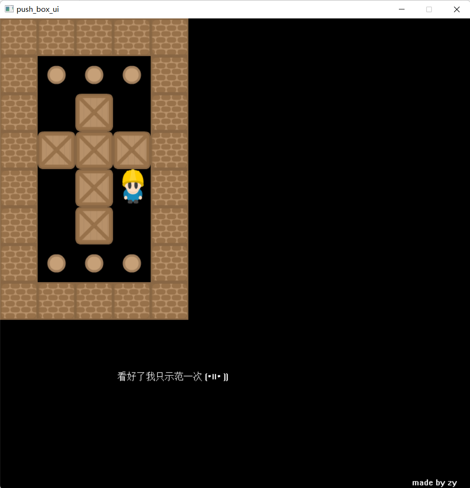

# push_box_solver
a solver with UI for push box game

## usage
1. put the map information in the map.txt
the first line means the height and width of the map.

- \# means wall
- o means road
- d means box destination
- X means box
- p means player

2. execute the .exe file,the program will show the solution for it.

